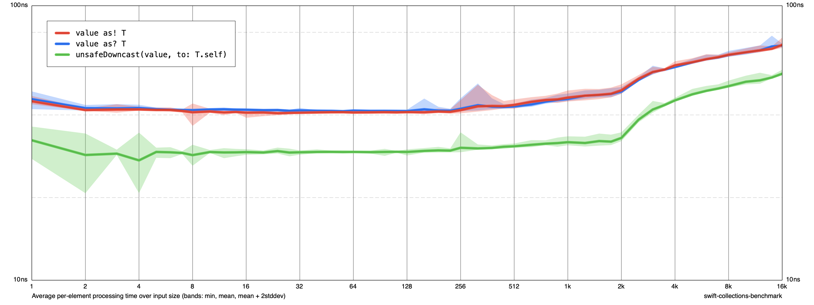

# HeterogeneousStorageBenchmarks


Comparing Heterogeneous Storage implementation
```swift
final class StorageSafeCasting: Storage {
    typealias Key = ObjectIdentifier

    private var _storage: [Key: Any] = [:]

    public func get<T: Container>(_ type: T.Type) -> T {
        let key = Key(type)
        if let value = _storage[key] {
            // #1 return value as! T
            // #2 return unsafeDowncast(value, to: T.self)
        }

        let value = type.init()
        _storage[key] = value
        return value
    }
}
```

Results for 20 000 classes.


## Generate
```sh
swift _generate.swift 10000
rm results \
|| rm chart.png \
|| swift run -c release storage-benchmark run results --max-size 10000 --cycles 10  \
&& swift run -c release storage-benchmark render results chart.png && open chart.png
```
